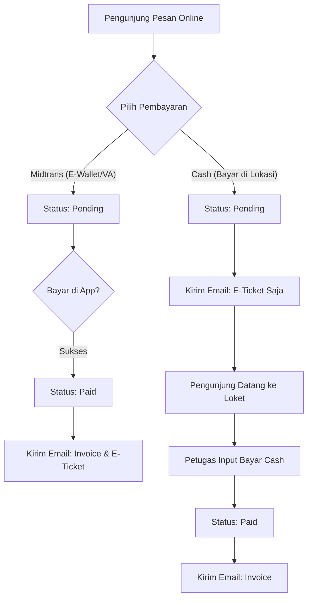
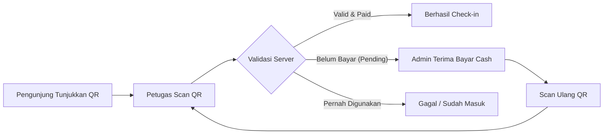

# Dokumentasi API Lengkap - Backend Mangli

Dokumentasi ini merinci semua modul, endpoint, serta struktur request JSON. Field ditandai dengan **(Wajib)** atau **(Opsional)**.

## Base URL

`http://localhost:3000/api`

> [!NOTE]
> Untuk endpoint yang memiliki parameter seperti `:id` atau `:orderId` di URL, nilai tersebut harus diisi di dalam URL request (Path Parameter), bukan di dalam Body JSON.

---

## 🔐 1. Auth (`/auth`)

_Autentikasi dan manajemen akun admin._

| Method | Endpoint           | Access | Deskripsi                            |
| :----- | :----------------- | :----- | :----------------------------------- |
| POST   | `/register`        | Public | Registrasi admin baru                |
| POST   | `/login`           | Public | Login admin & dapatkan token JWT     |
| GET    | `/profile`         | Admin  | Lihat profil admin yang sedang login |
| PUT    | `/profile`         | Admin  | Update profil admin                  |
| POST   | `/forgot-password` | Public | Request reset password via email     |
| POST   | `/reset-password`  | Public | Reset password dengan token          |

**Request Body (JSON):**

- **Register:**

```json
{
  "name": "Admin Nama", // (Wajib)
  "email": "admin@example.com", // (Wajib)
  "password": "password123", // (Wajib)
  "role": "admin" // (Opsional)
}
```

- **Login:**

```json
{
  "email": "admin@example.com", // (Wajib)
  "password": "password123" // (Wajib)
}
```

- **Update Profile:**

```json
{
  "current_password": "oldpassword123", // (Wajib)
  "name": "Nama Baru", // (Opsional)
  "password": "newpassword123" // (Opsional)
}
```

- **Forgot Password:**

```json
{
  "email": "admin@example.com" // (Wajib)
}
```

- **Reset Password:**

```json
{
  "token": "token-dari-email", // (Wajib)
  "new_password": "passwordbaru123" // (Wajib)
}
```

---

## 📦 2. Tour Package (`/tour-packages`)

_Manajemen paket wisata._

| Method | Endpoint                                                                                                      | Access | Deskripsi                 |
| :----- | :------------------------------------------------------------------------------------------------------------ | :----- | :------------------------ |
| GET    | `/`                                                                                                           | Public | List semua paket aktif    |
| GET    | `/:slug`                                                                                                      | Public | Detail paket via slug     |
| POST   | `/`                                                                                                           | Admin  | Buat paket wisata baru    |
| PUT    | [/:id](file:///Users/mac/Documents/coding-mengcoding/JavaScript/backend_mangli/src/middlewares/auth.ts#44-68) | Admin  | Update data paket         |
| DELETE | [/:id](file:///Users/mac/Documents/coding-mengcoding/JavaScript/backend_mangli/src/middlewares/auth.ts#44-68) | Admin  | Hapus paket (soft delete) |

**Request Body (JSON - Create/Update):**

```json
{
  "name": "Nama Paket", // (Wajib)
  "slug": "paket-slug", // (Wajib)
  "description": "Deskripsi paket", // (Wajib)
  "price": 50000, // (Wajib)
  "duration_days": 1, // (Wajib)
  "max_participants": 100, // (Wajib)
  "location": "Link Google Maps/Alamat", // (Wajib)
  "available_days": [0, 1, 2, 3, 4, 5, 6], // (Wajib)
  "discount_price": 45000, // (Opsional)
  "image_url": "https://...", // (Opsional)
  "gallery_urls": ["url1", "url2"], // (Opsional)
  "is_active": true, // (Opsional)
  "blocked_dates": ["2026-12-25"] // (Opsional)
}
```

---

## 🛒 3. Order (`/orders`)

_Pemesanan tiket oleh pelanggan._

| Method | Endpoint                                                                                                      | Access | Deskripsi                          |
| :----- | :------------------------------------------------------------------------------------------------------------ | :----- | :--------------------------------- |
| POST   | `/`                                                                                                           | Public | Buat pesanan baru                  |
| GET    | `/number/:orderNumber`                                                                                        | Public | Lacak pesanan via nomor order      |
| GET    | `/`                                                                                                           | Admin  | List semua pesanan                 |
| GET    | [/:id](file:///Users/mac/Documents/coding-mengcoding/JavaScript/backend_mangli/src/middlewares/auth.ts#44-68) | Admin  | Detail pesanan                     |
| PATCH  | `/:id/status`                                                                                                 | Admin  | Update status pesanan              |
| PATCH  | `/:id/cancel`                                                                                                 | Admin  | Batalkan pesanan (pending only)    |
| POST   | `/expire-check`                                                                                               | Admin  | Trigger manual cek pesanan expired |

**Request Body (JSON):**

- **Create Order:**

```json
{
  "full_name": "Nama Pelanggan", // (Wajib)
  "phone_number": "0812345678", // (Wajib)
  "email": "customer@email.com", // (Wajib)
  "visit_date": "2026-03-25", // (Wajib) Format: YYYY-MM-DD
  "payment_method": "midtrans", // (Wajib) "midtrans" atau "cash"
  "items": [
    // (Wajib)
    { "tour_package_id": "uuid-paket", "quantity": 2 }
  ],
  "admin_notes": "Catatan tambahan" // (Opsional)
}
```

- **Update Status:**

```json
{
  "status": "paid", // (Wajib) settlement, challenge, pending, cancelled, dll.
  "admin_notes": "Catatan admin" // (Opsional)
}
```

---

## 💳 4. Payment (`/payments`)

_Pemrosesan pembayaran._

| Method | Endpoint                 | Access | Deskripsi                        |
| :----- | :----------------------- | :----- | :------------------------------- |
| POST   | `/midtrans/:orderId`     | Public | Inisialisasi pembayaran Midtrans |
| POST   | `/midtrans/notification` | Public | Webhook Midtrans                 |
| POST   | `/cash/:orderId`         | Admin  | Bayar tunai di lokasi            |
| GET    | `/order/:orderId`        | Admin  | Histori bayar per order          |
| GET    | `/`                      | Admin  | List semua transaksi             |

**Request Body (JSON - Cash Payment):**

```json
{
  "amount": 100000, // (Wajib)
  "received_by": "Nama/ID Admin", // (Wajib)
  "payment_channel": "Loket Utama", // (Opsional)
  "receipt_number": "RCP123" // (Opsional)
}
```

---

## 🎟️ 5. Ticket & Invoice

_Pengiriman dokumen._

| Module  | Method | Endpoint                  | Access | Deskripsi                  |
| :------ | :----- | :------------------------ | :----- | :------------------------- |
| Ticket  | GET    | `/tickets/:orderId/print` | Public | Tampilan tiket untuk cetak |
| Ticket  | POST   | `/tickets/:orderId/send`  | Admin  | Kirim ulang email tiket    |
| Invoice | POST   | `/invoices/`              | Admin  | Kirim email invoice        |

**Request Body (JSON):**

- **Resend Ticket:**
  > ID Pesanan diambil dari URL (`:orderId`)

```json
{
  "to_email": "alternatif@email.com" // (Opsional) Jika kosong, kirim ke email di order
}
```

- **Send Invoice:**

```json
{
  "order_id": "uuid-order-123" // (Wajib)
}
```

---

## 🤳 6. Visitor Check-in (`/visitor-checkins`)

_Validasi kedatangan pengunjung._

| Method | Endpoint   | Access | Deskripsi                  |
| :----- | :--------- | :----- | :------------------------- |
| POST   | `/`        | Admin  | Check-in pengunjung manual |
| POST   | `/scan`    | Admin  | Check-in via QR Scan       |
| GET    | `/summary` | Admin  | Statistik harian           |
| GET    | `/`        | Admin  | History check-in           |

**Request Body (JSON):**

- **Manual Check-in:**

```json
{
  "order_id": "uuid-order-123", // (Wajib)
  "number_of_visitors": 2, // (Wajib)
  "notes": "Catatan check-in" // (Opsional)
}
```

- **QR Scan Check-in:**

```json
{
  "qr_data": "{\"order_id\": \"uuid-order-123\"}" // (Wajib) JSON string dari QR
}
```

---

## 📦 7. Order Items (`/order-items`)

| Method | Endpoint                     | Access | Deskripsi                  |
| :----- | :--------------------------- | :----- | :------------------------- |
| GET    | `/api/orders/:orderId/items` | Admin  | List item dalam satu order |
| POST   | `/api/orders/:orderId/items` | Admin  | Tambah item ke order       |
| PUT    | `/api/order-items/:id`       | Admin  | Update quantity item       |
| DELETE | `/api/order-items/:id`       | Admin  | Hapus item dari order      |

**Request Body (JSON):**

- **Add Item:**

```json
{
  "tour_package_id": "uuid-paket", // (Wajib)
  "quantity": 2 // (Wajib)
}
```

- **Update Item Quantity:**

```json
{
  "quantity": 3 // (Wajib)
}
```

---

## 📂 8. Dashboard, Upload & Notif

### Dashboard (`/dashboard`)

| Method | Endpoint   | Access | Deskripsi                                   |
| :----- | :--------- | :----- | :------------------------------------------ |
| GET    | `/summary` | Admin  | Ringkasan dashboard (period: daily/monthly) |

### Upload (`/upload`)

| Method | Endpoint | Access | Deskripsi                         |
| :----- | :------- | :----- | :-------------------------------- |
| POST   | `/image` | Admin  | Upload foto (Multipart form-data) |
| DELETE | `/image` | Admin  | Hapus foto dari storage           |

**Request Body (Upload/Delete):**

- **Upload Image**: Menggunakan `multipart/form-data`, key: `image` (File).
- **Delete Image (JSON)**:

```json
{
  "file_url": "https://storage.example.com/tour-packages/image.jpg" // (Wajib)
}
```

### Admin Notifications (`/admin-notifications`)

| Method | Endpoint        | Access | Deskripsi                      |
| :----- | :-------------- | :----- | :----------------------------- |
| GET    | `/unread-count` | Admin  | Jumlah notif belum dibaca      |
| PATCH  | `/read-all`     | Admin  | Tandai semua terbaca           |
| GET    | `/`             | Admin  | List semua notifikasi          |
| PATCH  | `/:id/read`     | Admin  | Tandai satu notifikasi terbaca |

---

## 🤖 9. Fitur Otomatis (Background & Triggers)

Selain endpoint di atas, sistem juga menjalankan fungsi otomatis berikut:

### **A. Pembatalan Otomatis (Cron Job)**

- **Deskripsi**: Sistem secara rutin mengecek pesanan dengan status `pending` yang sudah melewati batas waktu bayar (`expired_at`).
- **Aksi**: Mengubah status pesanan menjadi `expired` sehingga kuota tiket kembali tersedia.

### **B. Sinkronisasi Pembayaran (Webhook)**

- **Deskripsi**: Menangani notifikasi otomatis dari server Midtrans.
- **Aksi**:
  - Update status pembayaran secara real-time.
  - Update status pesanan menjadi `paid` secara otomatis.

### **C. Pengiriman Email Otomatis**

- **Deskripsi**: Invoice dan Tiket dikirim secara **bersamaan** segera setelah sistem mengonfirmasi pembayaran (`paid`).
- **Timing (Kapan didapat?):**
  - **Midtrans**: Pengunjung menerima **Invoice & E-Ticket** secara bersamaan beberapa detik setelah pembayaran di aplikasi (misal ShopeePay/Gopay/M-Banking) dinyatakan **Berhasil/Settlement**.
  - **Cash (Pesan Online, Bayar di Lokasi)**:
    1. **Saat Pesan Online**: Pengunjung langsung menerima email **E-Ticket** (agar punya bukti reservasi/tiket untuk masuk), meskipun belum bayar. Status pesanan masih `pending`.
    2. **Saat Bayar di Lokasi**: Setelah Admin konfirmasi pembayaran, pengunjung baru menerima email **Invoice** sebagai bukti pelunasan.
  - **Cash (Walk-in/Beli di Tempat)**: Pengunjung langsung menerima email **Invoice & E-Ticket** secara bersamaan saat Admin selesai menginput data di kasir.
- **Aksi**:
  - Mengirim **Invoice** (Bukti Pembayaran).
  - Mengirim **E-Ticket** (Berisi QR Code untuk Check-in).

### **D. Notifikasi Admin**

- **Deskripsi**: Terjadi setiap kali ada aktivitas penting.
- **Aksi**: Mengirim notifikasi ke tabel `admin_notifications` untuk pesanan baru dan pembayaran masuk agar admin bisa langsung memantau dari dashboard.

## 📊 Alur Bisnis (Visual Flow)

### A. Alur Pemesanan & Pembayaran


### B. Alur Check-in (Validasi Tiket)


> [!TIP]
> **Skenario Bayar di Lokasi**: Jika pengunjung datang membawa E-Ticket (QR) tetapi statusnya masih `pending`, hasil scan akan menunjukkan error/gagal. Admin harus melakukan input pembayaran tunai terlebih dahulu di menu Pembayaran (atau endpoint `/payments/cash/:orderId`), setelah status berubah menjadi `paid`, scan ulang QR Code tersebut untuk menyelesaikan check-in.

---